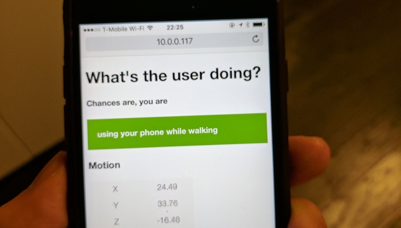

  <b>whats.the.user.doing</b> &bull;
  <a href="https://github.com/krausefx/detect.location">detect.location</a> &bull;
  <a href="https://github.com/KrauseFx/watch.user">watch.user</a> &bull;
  <a href="https://github.com/KrauseFx/steal.password">steal.password</a>

-------

# What's the user doing

Modern web browsers give the user more control over what data they're sharing with websites, for example location services and access to the camera.

However I recently noticed a gap of how websites can determine the activity of the user based on the acceleration and gyro sensor built into modern smartphones, including the iPhone and Android phones.

Using that data, any website can determine if the user is using their phone while

- sitting
- standing
- walking
- running
- driving
- taking a picture
- lying in bed
- laying the phone on a table

and probably more, including guesses if the user is actively using their phone at this moment, or even if they're impaired by alcohol.

## This project

This was a 1h Sunday night hack project, where I wanted to see how easy it is to guess what the user is doing based on the data, without using any JS libraries, artificial intelligence or even any kind of pattern recognition.

**[Open the web-app on your mobile device](https://krausefx.github.io/user.activity)**

All source code can be found in a single file: [index.html](https://github.com/KrauseFx/whats-the-user-doing/blob/master/index.html)

## Take action

This project was by no means designed to be used to track the user, but instead make people aware of how easy it is to use that data, and get Apple to add a permission prompt of acceleration sensors for websites and mobile apps.

You can dupe the radar [rdar://34234813](https://openradar.appspot.com/34234813) 👍

Evil companies can afford to spend more resources on writing an excellent detection algorithm to (ab)use the sensor data to detect what the user is doing without getting their permission.

On the other hand, this could be used for positive things also, imagine a (web)app not showing a certain popup because it notices that you're busy driving a car or walking on a street.

## License

This project is licensed under the terms of the MIT license. See the [LICENSE](LICENSE) file.

> This project is in no way affiliated with Apple Inc or Google Inc. This project is open source under the MIT license, which means you have full access to the source code and can modify it to fit your own needs.

